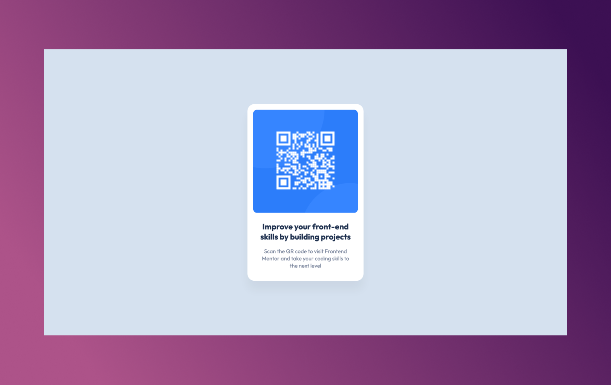

# QR Code Component




### Description
This is a very simple static project built with svelte only for fun and having a flavor of svelte.
Have a look at the live demo:

#### [Live Demo](https://qr-code-component-wine-sigma.vercel.app/)


#### About
Github Repo can be found [here](https://github.com/towkir/qr-code-component) (if you're not already viewing this from github)


---

#### Develop and Build

If you've forked this repo, follow these commands:

```bash
# install dependencies
npm install

# start the server
npm run dev

# or start the server and open the app in a new browser tab
npm run dev -- --open
```

To create a production version of the app:

```bash
npm run build
```

You can preview the production build with `npm run preview`.

> To deploy the app, you may need to install an [adapter](https://kit.svelte.dev/docs/adapters) for your target environment.
